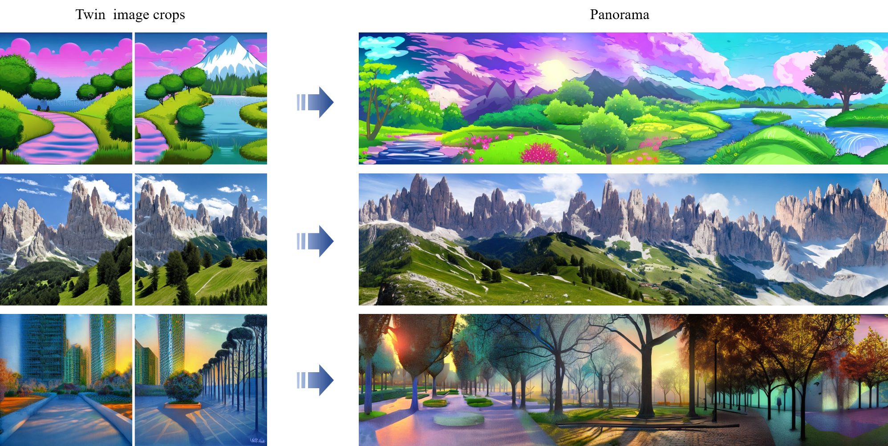

# 🦉TwinDiffusion: Enhancing Coherence and Efficiency in Panoramic Image Generation with Diffusion Models (ECAI 2024)

## Brief Look



**TwinDiffusion** is a multiDiffusion-based framework that integrates two straightforward but effective methods to generate panoramic images with
improved quality and efficiency.

> **Abstract** &ensp; Diffusion models have emerged as effective tools for generating diverse and high-quality content. However, their capability in high-resolution image generation, particularly for panoramic images, still faces challenges such as visible seams and incoherent transitions. In this paper, we propose TwinDiffusion, an optimized framework designed to address these challenges through two key innovations: the Crop Fusion for quality enhancement and the Cross Sampling for efficiency optimization. We introduce a training-free optimizing stage to refine the similarity of adjacent image areas, as well as an interleaving sampling strategy to yield dynamic patches during the cropping process. A comprehensive evaluation is conducted to compare TwinDiffusion with the prior works, considering factors including coherence, fidelity, compatibility, and efficiency. The results demonstrate the superior performance of our approach in generating seamless and coherent panoramas, setting a new standard in quality and efficiency for panoramic image generation. 

For more details, please visit our [paper page](https://arxiv.org/abs/2404.19475).

## Quick Start

**Installation** &ensp; Set up and configure the environment by installing the required packages:

```bash
pip install -r requirements.txt
```

**Generation** &ensp; We support SDXL and batch generation, you can generate twin images and panoramic images with the following command:

```bash
python twin.py --prompt "A photo of dolomites" --seed 5 --n 3
```
```bash
python panorama.py \
    --prompt "Landscape ink painting" \
    --sd_version '2.0' \
    --H 512 \
    --W 4096 \
    --seed -1 \
    --lam 1 \
    --view_stride 16 \
    --cross_time 2 \
    --n 1
```

**App** &ensp; We also provide a gradio app for interactive testing:

```bash
python app_gradio.py
```

## Citation

If you find our work helpful, please consider citing:

```bibtex
@article{zhou2024twindiffusion,
  title={TwinDiffusion: Enhancing Coherence and Efficiency in Panoramic Image Generation with Diffusion Models},
  author={Zhou, Teng and Tang, Yongchuan},
  journal={arXiv preprint arXiv:2404.19475},
  year={2024}
}
```